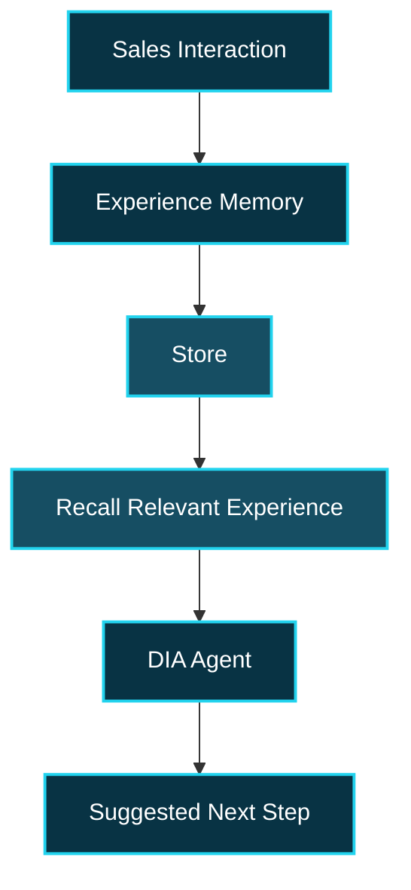
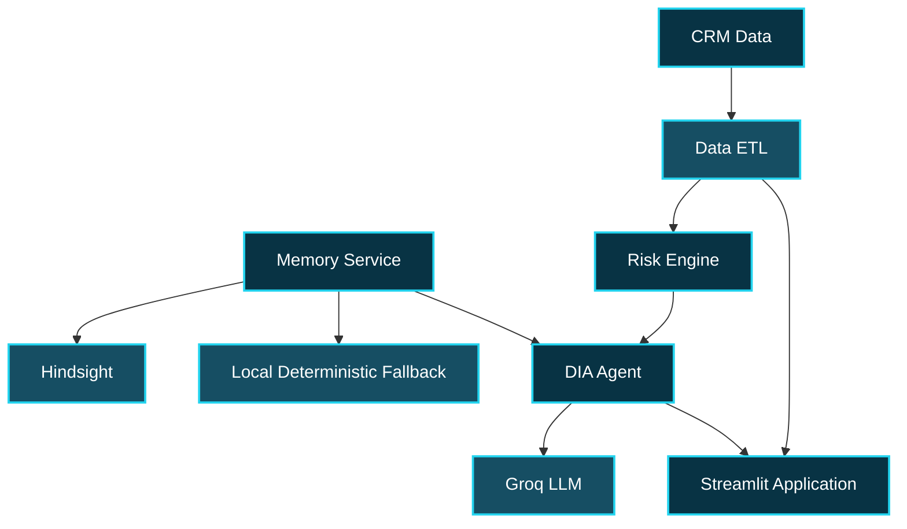

# DIA — Deal Intelligence Agent

<p align="center">
  <strong>Memory-enabled deal intelligence for contextual opportunity analysis</strong>
</p>

<p align="center">
  <code>CRM Data</code> · <code>Risk Signals</code> · <code>Experience Memory</code> · <code>Explainable Next Steps</code>
</p>

---

## Overview

DIA (Deal Intelligence Agent) is a memory-enabled deal intelligence application that connects current CRM information, opportunity risk signals, and previous sales experiences to help users understand a deal and identify a relevant next step.

The system is designed around a simple idea: current deal information becomes more useful when it can be interpreted alongside relevant experience from previous interactions.

---

## Core Workflow


The workflow follows four main stages:

1. Load and prepare the current CRM information.
2. Identify relevant opportunity and risk signals.
3. Recall previous experiences that provide useful context.
4. Combine the available evidence into an explainable response.

---

# Quick Start

## Prerequisites

- Python 3.11 or later
- Git
- Groq API key for live language-model responses
- Hindsight API key for live external memory

The application also includes a deterministic local fallback for the memory layer, allowing the core demonstration to run without a live Hindsight connection.

---

## Installation

Clone the repository:

```bash
git clone https://github.com/Mounika3v/DIA-Deal-Intelligence.git
cd DIA-Deal-Intelligence
```

Install the dependencies:

```bash
pip install -r requirements.txt
```

Create the environment file:

```bash
cp .env.example .env
```

Configure the required values in `.env`:

```env
GROQ_API_KEY=
HINDSIGHT_API_KEY=
HINDSIGHT_API_URL=https://api.hindsight.vectorize.io
HINDSIGHT_BANK_ID=dia-sales-memory
GROQ_MODEL=openai/gpt-oss-120b
```

Run the application:

```bash
streamlit run app.py
```

---

# Application

DIA is organized into three main views.

## Command Center

The Command Center provides a high-level view of the available opportunity and pipeline information.

It includes:

- Closed-won revenue
- Opportunity count
- Open pipeline
- Historical win rate
- Pipeline risk signals
- Memory differentiator information

The Command Center is intended to provide the initial context before moving into an individual opportunity.

---

## Deal Copilot

Deal Copilot focuses on an individual opportunity.

It brings together:

- Current CRM facts
- Opportunity risk signals
- Relevant historical experience
- Agent-generated reasoning

The response is structured to distinguish information that comes directly from the CRM from information recalled from previous experience.

---

## Memory Lab

Memory Lab provides visibility into the experience-memory layer.

It demonstrates how previous interactions can be retained and recalled as contextual information for future deal analysis.

---

# Memory Architecture

DIA uses a memory-first design.

Hindsight is used as the external memory service when configured. The project also provides a deterministic local fallback so the application remains usable during development and demonstrations when external credentials or services are unavailable.



The memory layer is focused on experience rather than simply storing another copy of the CRM record.

A remembered interaction can contain:

| Field | Purpose |
|---|---|
| Opportunity | Links the experience to a deal |
| Account | Identifies the associated account |
| Sales agent | Records the person involved |
| Timestamp | Provides temporal context |
| Interaction type | Describes the type of interaction |
| Stakeholder role | Captures stakeholder context |
| Objection category | Classifies the objection |
| Objection detail | Records the specific concern |
| Sales response | Records how the concern was handled |
| Customer reaction | Records the response |
| Deal outcome | Records the eventual result |
| Distilled learning | Captures the reusable lesson |

---

# Risk Analysis

DIA includes a dedicated risk-analysis layer for opportunities.

The current risk engine considers signals including:

- Deal staleness
- Opportunity context
- Pricing-related risk

The system keeps the overall deal-risk signal separate from the individual factors contributing to it.

This makes the risk result easier to inspect and connect to the underlying opportunity information.

---

# Explainable Agent Responses

DIA is designed to keep current facts, recalled experience, and recommendations distinguishable.

Agent responses are organized into three sections:

### 1. CRM Facts

Information supported by the current opportunity and CRM data.

### 2. Recalled Hindsight Experience

Relevant experience retrieved from the memory layer.

### 3. Suggested Next Steps

Potential actions derived from the available CRM facts and recalled experience.

The agent is instructed not to fabricate unsupported business calculations or outcomes.

This includes avoiding invented:

- ROI
- Payback periods
- NPV
- Cost savings
- Discounts
- Benchmarks
- Business outcomes

When the available information is insufficient for a calculation, the system uses:

> Insufficient data to calculate this.

Recommendations are presented as suggested next steps rather than as claims about actions that have already been taken.

---

# Data

## CRM Data

DIA uses a supplied CRM dataset sourced from Kaggle.

The raw CRM files are stored under:

```text
data/raw/
```

The ETL pipeline expects:

```text
accounts.csv
products.csv
sales_teams.csv
sales_pipeline.csv
```

These files provide the structured information used by the application for opportunity analysis and risk evaluation.

---

## Experience Memory Data

The project contains a separate synthetic interaction-memory layer:

```text
data/synthetic/interactions.json
```

This layer is used to demonstrate the memory workflow.

The interaction records contain information such as:

- Stakeholder role
- Objection category
- Objection details
- Sales response
- Customer reaction
- Deal outcome
- Distilled learning

The synthetic interaction layer is separate from the supplied CRM dataset and is used specifically to demonstrate experience recall.

---

# Example Experience

One demonstration interaction contains a pricing-related discussion involving a CFO.

The interaction records:

- A pricing objection
- The buyer's concern about the annual price
- A response based on longer-term total cost of ownership and phased deployment
- Movement toward executive review
- The eventual deal outcome
- A distilled learning from the interaction

DIA can use this historical experience as contextual information when analyzing a relevant opportunity.

The historical interaction is kept distinct from current CRM facts.

---

# Technology Stack

| Layer | Technology |
|---|---|
| Application | Streamlit |
| Language | Python |
| Data Processing | Pandas, NumPy |
| Visualization | Plotly |
| Language Model | Groq |
| External Memory | Hindsight |
| Configuration | python-dotenv |
| Testing | Pytest |

---

# Project Architecture



The application is intentionally divided into data preparation, risk analysis, memory, agent, language-model, and UI components.

---

# Repository Structure

```text
DIA-Deal-Intelligence/
│
├── app.py
├── requirements.txt
├── .env.example
├── pytest.ini
│
├── ARCHITECTURE.md
├── DEMO_SCRIPT.md
├── README.md
│
├── data/
│   ├── raw/
│   │   ├── accounts.csv
│   │   ├── products.csv
│   │   ├── sales_teams.csv
│   │   └── sales_pipeline.csv
│   │
│   └── synthetic/
│       └── interactions.json
│
├── src/
│   ├── agent/
│   │   └── dia.py
│   │
│   ├── config/
│   │   └── settings.py
│   │
│   ├── data/
│   │   ├── etl.py
│   │   └── synthetic_memory.py
│   │
│   ├── llm/
│   │   └── groq.py
│   │
│   ├── memory/
│   │   └── service.py
│   │
│   ├── risk/
│   │   └── engine.py
│   │
│   └── ui/
│       └── styles.py
│
└── tests/
```

---

# Repository Components

### `app.py`

Main Streamlit application entry point.

It connects the data, risk, memory, agent, and UI layers and provides the application's primary views.

### `src/data/etl.py`

Loads and prepares the CRM datasets used by the application.

### `src/risk/engine.py`

Calculates opportunity risk signals from the available deal information.

### `src/data/synthetic_memory.py`

Builds the demonstration interaction-memory layer.

### `src/memory/service.py`

Provides the memory interface.

It uses Hindsight when configured and a deterministic local fallback when the external memory service is unavailable.

### `src/agent/dia.py`

Contains the DIA agent logic and response formatting.

### `src/llm/groq.py`

Handles the Groq language-model integration and applies the response-grounding rules used by DIA.

### `src/config/settings.py`

Loads application configuration and environment variables.

### `src/ui/styles.py`

Contains the Streamlit interface styling.

---

# Demo Flow


A typical demonstration moves from the overall pipeline view into an individual opportunity, then shows how current CRM information and recalled experience contribute to the final suggested next steps.

---

# Running Without External Services

The external Groq and Hindsight services can be configured through `.env`.

The memory service also includes a deterministic local fallback.

This allows the project to remain usable when a live memory connection is unavailable.

The fallback is intended for local development and demonstration rather than as a replacement for the external memory service.

---

# Testing

The repository includes a `tests/` directory.

Run the available tests with:

```bash
pytest
```

---

# Security and Configuration

DIA uses environment variables for service credentials.

Do not commit real credentials to the repository.

The repository provides:

```text
.env.example
```

as the configuration template.

The actual `.env` file should remain local.

The project also keeps the synthetic interaction-memory layer separate from the supplied CRM dataset.

---

# Design Principles

### Grounded information

Agent responses should remain connected to available CRM facts and recalled experience.

### Separation of evidence

Current opportunity information and historical experience are presented separately.

### Explainability

Risk signals and recommendations should be understandable from the information available to the system.

### Memory as context

Previous interactions are used when they provide relevant context for the current opportunity.

### Reliable demonstration

The local memory fallback allows the application to remain usable when external services are unavailable.

---

# Current Scope

The current implementation focuses on:

- CRM opportunity analysis
- Pipeline information
- Deal-risk signals
- Experience memory
- Historical interaction recall
- Explainable agent responses
- Suggested next steps
- Streamlit application interface
- Hindsight memory integration
- Deterministic local memory fallback

The project demonstrates how structured opportunity information and persistent experience can be combined into a single deal-intelligence workflow.

---

# Project Documentation

Additional documentation is available in the repository:

- `ARCHITECTURE.md` — architecture details
- `DEMO_SCRIPT.md` — demonstration flow and presentation guidance

---

# Project Status

DIA is a hackathon project built as a working demonstration of memory-enabled deal intelligence.

The current implementation focuses on connecting:

```text
CRM Data
      +
Risk Analysis
      +
Experience Memory
      +
Agent Reasoning
      =
Contextual Deal Intelligence
```

---

DIA explores how persistent experience memory can be combined with structured opportunity information to provide contextual and explainable assistance during deal analysis.
